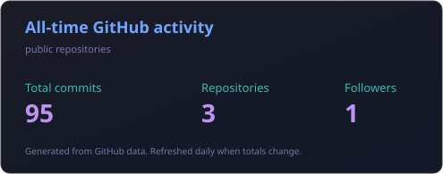

## Building now

### Archtech nonprofit technology operations

I set up Google Workspace for a developing nonprofit and coordinate the team currently building its website. My main responsibility is the site&apos;s hosting and deployment workflow. I contribute to development as part of the team, but infrastructure and web operations are my primary focus. The source repository and internal work remain private.

### Personal portfolio

A dark, multi-page portfolio built with TypeScript, React, Vinext, Vite, and Cloudflare Workers. It includes project case studies, responsive interest pages, custom CSS graphics, metadata, automated route checks, and a full public README.

- [Live site](https://affan-shaikh-portfolio.sil6428-archtech.workers.dev)
- [Source repository](https://github.com/sil6428/Portfolio.github.io)

## Other projects

- **CICIDS2017 Reproduction:** Audited 2,830,743 network flows and measured how evaluation splits changed a Random Forest intrusion-detection result
- **File Integrity Monitor:** Python and SHA-256 tool validated against 45 controlled filesystem changes and 7 automated tests
- **Network Labs:** VLANs, trunking, DHCP, STP, inter-VLAN routing, and Cisco IOS routing practice
- **Event Planner:** Node.js tool for adding, editing, and removing events

## Skills

### Code

### Web and interface work

### Networks and security

### Systems, testing, and deployment

## Live GitHub activity

## Public repositories

- [Portfolio](https://github.com/sil6428/Portfolio.github.io)
- [CICIDS2017 Reproduction](https://github.com/sil6428/cicids2017-reproduction)
- [Learning Log](https://github.com/sil6428/learning-log)

